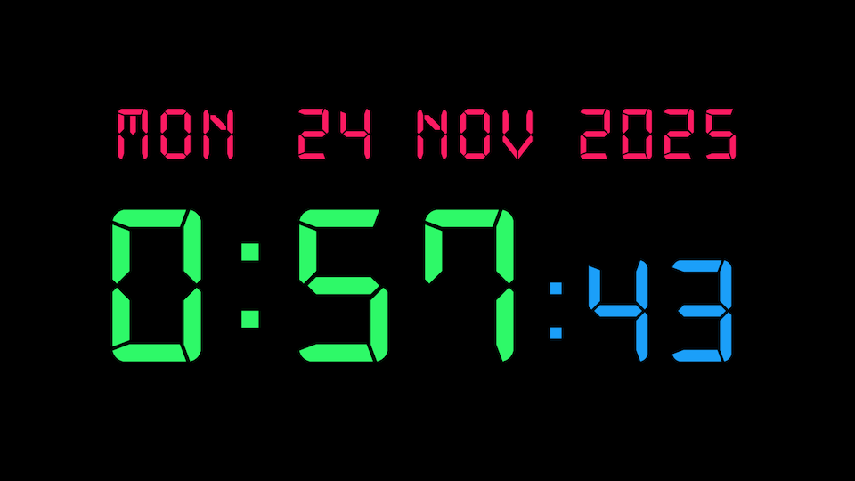

# 7-segment-screen-clock-web

This is a simple 7-segment clock for the web.



Simply open [7-segment-screen-clock-web](https://mike-seger.github.io/7-segment-screen-clock-web/) to see it live.

Clicking on the year toggles the full screen mode.

## Run a local webserver for extended functionality

In order to run the clock with configuration functionality without CORS issues, you need to run a local web
server.

```
python3 ./no-cache-server.py
```

## embedded clock page on android device

### Push the html file to the device
This works oob if only a single device is connected to your computer.  
Otherwise check the adb docs.

```
adb shell mkdir /sdcard/Download/clock
adb push index-embedded.html /sdcard/Download/clock/index-embedded.html
```

